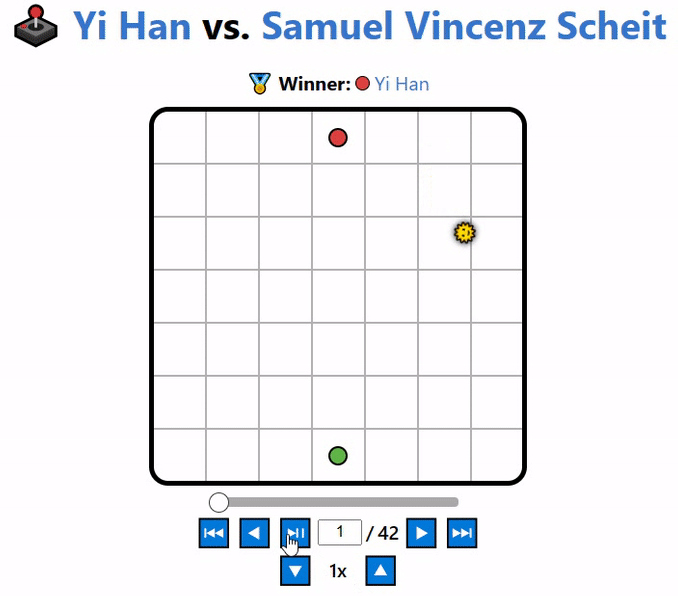
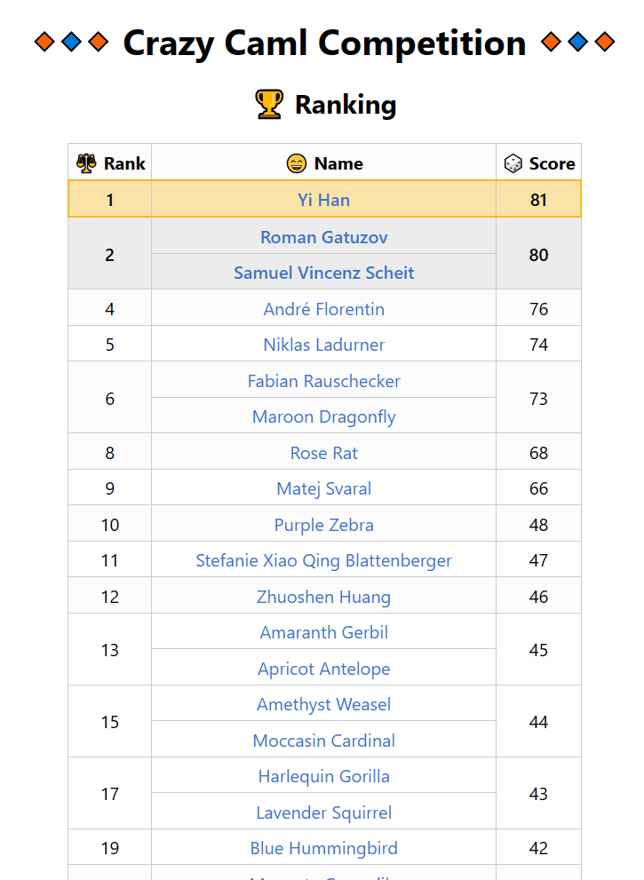
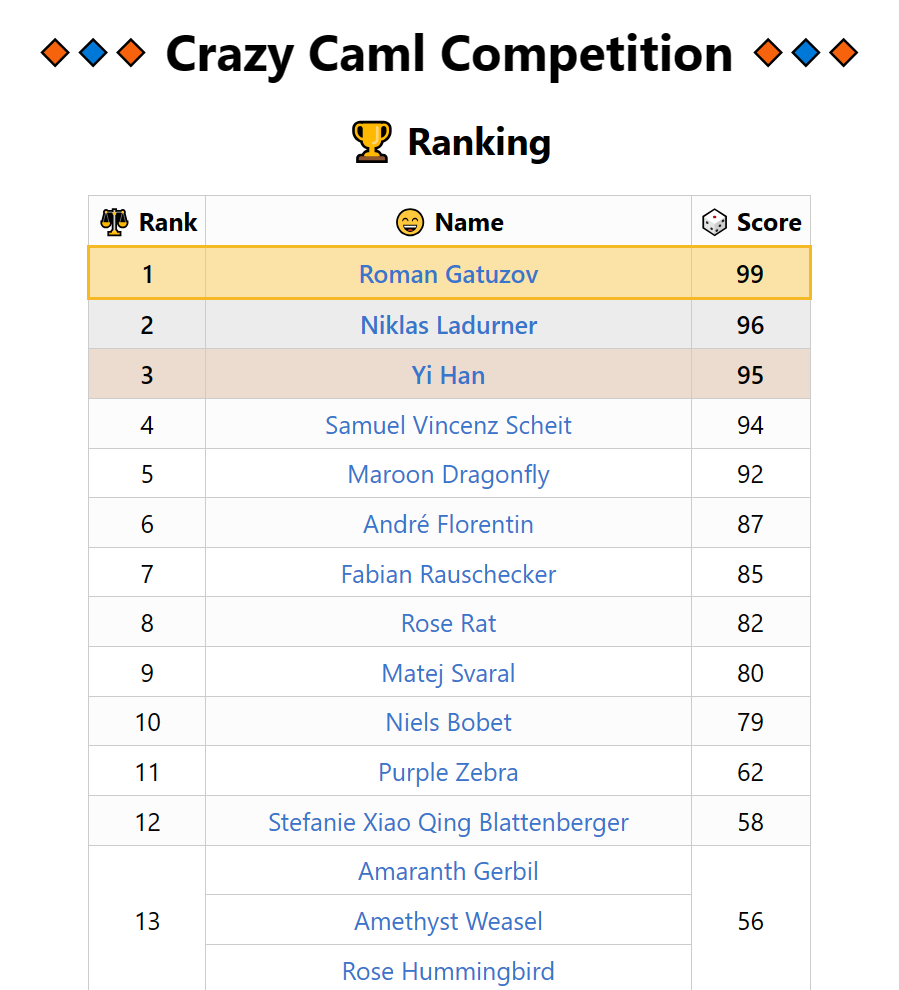
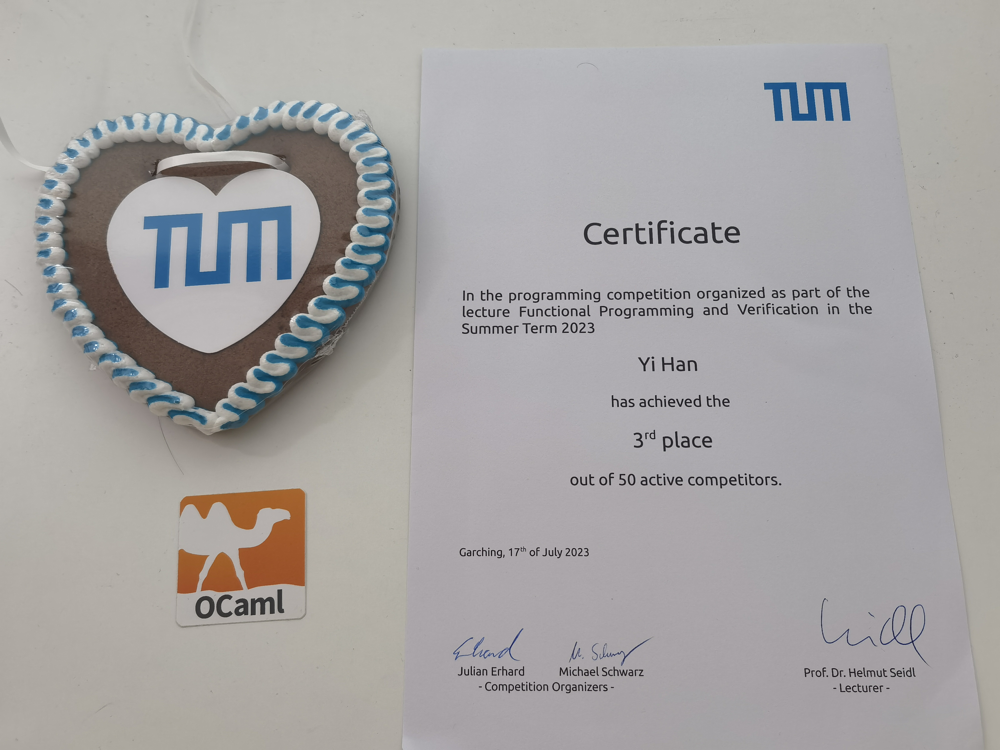

# Functional Programming Exercises

Welcome to the repository for the course *Functional Programming and Verification* at TUM during the Summer Semester of 2023.

Here, you will find a collection of exercises designed to help you practice and master functional programming concepts. The primary language used for these exercises is [Ocaml](https://ocaml.org), a powerful functional programming language.

Please note that all codes in this repository are intended to run on Linux systems.

Feel free to explore the exercises, work on them, and deepen your understanding of functional programming. If you have any questions or need assistance, don't hesitate to reach out.

# Table of Contents
- [Victory in Crazy Camel Competition](#victory-in-crazy-camel-competition)
- [Excercise Contents](#excercise-contents)
- [Algorithms](#algorithms)
- [Achievements 🏆](#achievements-)

# Victory in [Crazy Camel Competition](#achievements-)

# Excercise Contents
- [Week 5: Basic Syntax of Ocaml](https://github.com/Blattvorhang/Functional-Programming-Excercises/tree/main/Week_05)
  - Pre-defined Constants and Operators
  - Pairs, Tuples and Records
  - Pattern-matching
  - `match` and `if`
  - Lists
  - Recursive Functions

- [Week 6: User-defined Datatypes](https://github.com/Blattvorhang/Functional-Programming-Excercises/tree/main/Week_06/)
  - Enumeration Types
  - Sum Types (constructor)
  - Option

- [Week 7: A closer Look at Funcitons (Part One)](https://github.com/Blattvorhang/Functional-Programming-Excercises/tree/main/Week_07/)
  - Higher-order Functions
  - Anonymous Functions ($\lambda$-Calculus)

- [Week 8: A closer Look at Funcitons (Part Two)](https://github.com/Blattvorhang/Functional-Programming-Excercises/tree/main/Week_08/)
  - Tail Calls
  - Polymorphic Functions and Datatypes

- [Week 9: Practical Features of Ocaml](https://github.com/Blattvorhang/Functional-Programming-Excercises/tree/main/Week_09/)
  - Exceptions
  - Input and Output as Side-effects
  - Sequences

- [Week 10: The Module System of Ocaml](https://github.com/Blattvorhang/Functional-Programming-Excercises/tree/main/Week_10/)
  - Modules
  - Signatures
  - Information Hiding
  - Functors
  - Separate Compilation

- [Week 13: Parallel Programming](https://github.com/Blattvorhang/Functional-Programming-Excercises/tree/main/Week_13/)
  - Channels
  - Selevtive Communication
  - Threads and Exceptions
  - Buffered Communication
  - Multicasts

# Algorithms
This repository contains a list of various algorithms that I have used. You can explore the code and find implementations for each algorithm to understand their workings better.

- [Polynomial](./Week_05/Homework_04_PolynomialParty/)
- [Quadtree](./Week_06/Bonus_01_Quadtrees/)
- [Peano Arithmetic](./Week_06/Homework_01_PeanoArithmetic/)
- [Lagrange Interpolation](./Week_08/Bonus_01_Lagrange/)
- [In-Order Traversal (Tail-Recursive)](./Week_08/Homework_02_PolymorphicTrees/)
- [Polymorphic Lazy (Infinite) Binary Trees](./Week_08/Homework_03_InfiniteTrees_and_Bonus_02_InfiniteTreeSearch/)
- [Dynamic Programming (0-1 Knapsack)](./Week_09/Homework_01_CamelPresentFactory/)
- [Parse Matrix](./Week_10/Homework_01_ModulesModellingMatrices/)
- [Breadth First Search](./Week_10/Homework_02_and_Contest_CrazyCamelCompetition/)
- [Alpha-Beta Pruning](./Week_10/Homework_02_and_Contest_CrazyCamelCompetition/)

# Achievements 🏆
I am thrilled to share my recent achievement in a challenging individual strategy game contest! 🥇 Throughout the competition, I showcased outstanding performance, initially securing the first place and ultimately finishing in the top three. Consistently winning numerous rounds, I accumulated an impressive score.

As you can see from the ranking snapshots above, I consistently maintained a strong position in the contest, which demonstrates my dedication to excellence in strategic thinking and gameplay.

In addition to the satisfaction of victory, I received a well-deserved reward for my efforts. It was a delightful acknowledgment of my dedication and hard work during the contest.

I am excited to share my journey and experiences with you through this repository. My hope is that you can gain valuable insights and knowledge from my achievements and learning process. Feel free to explore the code and resources, and don't hesitate to reach out if you have any questions or want to discuss anything related to the contest or programming in general.

Let's continue this exciting journey of learning and strategic exploration together! Happy coding! 😊
