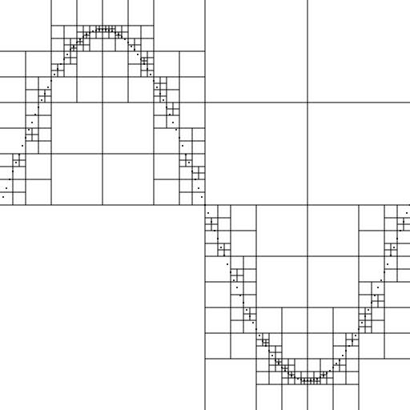

# Quadtrees
The quadtree data structure stores points by recursively partitioning a 2-dimensional region.

Let $Rect(x_1, y_1, x_2, y_2)$ denote the rectangular region with lower left corner $(x_1, y_1)$ and upper right corner $(x_2, y_2)$. We define that all points $(x, y)$ with $x_1 \leq x < x_2$ and $y_1 \leq y < y_2$  belong to this region. Every internal node represents a rectangular region $Rect(x_1, y_1, x_2, y_2)$ and has exactly four children, which represent the equally sized subregions $Rect(x_1, y_1, x_c, y_c)$, $Rect(x_1, y_c, x_c, y_2)$, $Rect(x_c, y_1, x_2, y_c)$ and $Rect(x_c, y_c, x_2, y_2)$ respectively, where $(x_c, y_c) = (\frac{x_1+x_2}{2}, \frac{y_1+y_2}{2})$ is the node's center point. Leaves are either empty or contain a single point.

At all times, every subtree rooted at node $N$ has the minimal height required to store all points that are inside the region corresponding to $N$. Every point $(x,y)$ is stored at most once, so if the same point is inserted a second time, the tree is unchanged. The following figure shows a quadtree of size 512x512 that stores 128 points along the sine wave:



We represent a quadtree node by the following sum type:

```Ocaml
type quadtree_node = NoPoint
                   | Point of int * int
                   | QNode of quadtree_node (* bottom left *)
                            * quadtree_node (* top left *)
                            * quadtree_node (* bottom right *)
                            * quadtree_node (* top right *)
```

and the entire quadtree with region $Rect(0, 0, width, height)$ is then represented by the ```quadtree``` type:

```Ocaml
type quadtree = {width:int; height:int; root:quadtree_node}
```
Note, that we do not store the region inside the individual nodes, but just in the tree itself, so node regions must be computed during tree traversal.

1. **insert** \
   Implement the function ```insert : point -> quadtree -> quadtree``` that inserts a point into the tree.

*Hint: You may assume that region sizes are always a power of two and that insert is only called for points* $(x,y)$ *that go into the tree’s region* $(0 \leq x < width ∧ 0 \leq y < height)$

*Hint: The function ```print_quadtree``` is provided to save an svg-image of your tree.*