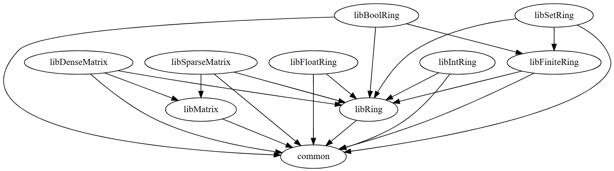

# Modules Modelling Matrices
We define the signature

```ocaml
module type Ring = sig
  type t
  val zero : t
  val one : t
  val add : t -> t -> t
  val mul : t -> t -> t
  val compare : t -> t -> int
  val to_string : t -> string
end
```

of an [algebraic ring structure](https://en.wikipedia.org/wiki/Ring_(mathematics)), where `add` and `mul` are the two binary operations on the set of elements of type `t`. Values `zero` and `one` represent the identity elements with respect to *addition* and *multiplication*. The function `compare` establishes a total order on the elements of the set. The auxiliary function `to_string` is used to generate a string representation of an element. This signature is available in `ring/libRing.ml`.

Furthermore, a matrix is given by the signature:

```ocaml
module type Matrix = sig
  type elem
  type t
  val create : int -> int -> t
  val identity : int -> t
  val from_rows : elem list list -> t
  val row_count : t -> int
  val col_count : t -> int
  val set : int -> int -> elem -> t -> t
  val get : int -> int -> t -> elem
  val transpose : t -> t
  val add : t -> t -> t
  val mul : t -> t -> t
  val to_string : t -> string
end
```

Here, `elem` and `t` represent the types of the elements of the matrix and the matrix itself, respectively. The functions have the following semantics:

- `create n m` creates an empty (all zeroes) $n\times m$ matrix.
- `identity n` creates an $n\times n$ identity matrix.
- `row_count m` and `col_count m` return the number of rows and columns in `m`, respectively.
- `from_rows l` creates a matrix from the given list of rows (lists of elements). You may assume that `l` is non-empty and all lists have the same length.
- `set r c v m` sets the element at row `r` and column `c` in matrix `m` to value `v`.
- `get r c m` returns the element at row `r` and column `c` from matrix `m`.
- `transpose m` returns the transpose of matrix `m`.
- `add a b` adds matrices `a` and `b` component-wise.
- `mul a b` computes the matrix multiplication of `a` and `b`.
- `to_string m` produces a string representation of `m`. Columns shall be separated by single whitespaces and rows by a newline character `\n`.

This signature is available in `matrix/libMatrix.ml`.

Perform these tasks:

- **IntRing**  
    In the file `intring/libIntRing.ml`: Implement a module `IntRing` that implements the `Ring` signature for the `int` type. [0.5 points]
- **FloatRing**  
    In the file `floatring/libFloatRing.ml`: Implement a module `FloatRing` that implements the `Ring` signature for the `float` type. [0.5 points]
- **FiniteRing**  
    In the file `finitering/libFiniteRing.ml`: Define a signature `FiniteRing` that extends the `Ring` signature with a value `elems` that represents a list of all elements of the ring's finite set. Make sure that everything in the `Ring` signature is part of `FiniteRing` (without copy-pasting them)! [0.5 points]
- **BoolRing**  
    In the file `boolring/libBoolRing.ml`: Implement a module `BoolRing` that implements the `FiniteRing` signature for the `bool` type. The multiplication in a bool ring is *conjunction*, the addition is the *exclusive or*. [0.5 points]
- **SetRing**  
    In the file `setring/libSetRing.ml`: Implement a functor `SetRing` that models a ring over the power set of the set in the `FiniteRing` passed as the functor's argument. `SetRing` has to implement the `Ring` signature. We use union and intersection as `add` and `mul` operations. The representation produced by `to_string` is $\left\{ e_1,\dots,e_n \right\}$. For `compare` we use a bit of an unconventional order. First, we order the elements in the set by their own order and then compare the sets lexicographically, e.g. $\emptyset<\left\{ 1,2,3 \right\}<\left\{ 2 \right\}<\left\{ 2,3 \right\}<\left\{ 3 \right\}$. The type `t` in `SetRing` should be `D.t list`, if `D` is the module that is passed to the functor. Make sure that this information about `t` is exposed to the outside. [1.5 points]
- **DenseMatrix**  
    In the file `densematrix/libDenseMatrix.ml`: Implement a functor `DenseMatrix` that satisfies the `Matrix` signature. The argument of the functor is a `Ring` that provides everything to implement the matrix operations. The `DenseMatrix` is supposed to store all elements in the matrix in a list of rows, which are lists of elements. [3 points]
- **SparseMatrix**  
    In the file `sparsematrix/libSparseMatrix.ml`: Implement a functor `SparseMatrix` that satisfies the `Matrix` signature. The argument of the functor is a `Ring` that provides everything to implement the matrix operations. The `SparseMatrix` stores only those elements of the matrix that are non-zero. More precisely, the representation of a sparse matrix must have memory usage proportional to the number of non-zero entries in the matrix ($\mathcal{O} (n)$). [3.5 points]

*Hint: You may assume that all inputs are valid, e.g. no out-of-bounds access. If you wish to handle invalid input, just throw an exception.*

*Hint: The function implementations need not be particularly efficient or tail-recursive, just keep your implementations simple where possible.*

### Assignment Repository Layout and Tests
Testing your solutions is more difficult this week as a test cannot compile if any module it depends on is not correctly implemented or a module signature is incorrectly defined. Thus, we have separated each module into its own `dune` library (one per directory). This way, we can compile and test each library independently. However, since some tasks require implementations of previous tasks, we have introduced dependencies between the libraries. If building any dependency of a library fails, we cannot test that library (and the corresponding task will receive zero points) as building it would fail too. You can consult the `dune` files or the graph below to see exactly what the dependencies are. If you don't want to submit a solution for some task, check Artemis to make sure that the public tests for the tasks that you do want to submit pass. In particular, look for the `*:build` tests, which pass only if that library can be tested and tell you why it cannot otherwise.

Write any code you want to share between tasks in `common/common.ml`.

To not cause issues with the tests, you should not change the provided `dune` files (the tests on Artemis will ignore your `dune` files).

<details>
    <summary mardown="span">Overview of dependencies</summary>


Example: If your implementation of `libFiniteRing` can't compile, then `libBoolRing` and `libSetRing` will not be tested and receive zero points.

Example: You can reuse any implementations you write in `libMatrix` in `libDenseMatrix` and `libSparseMatrix`, but don't change the `Matrix` signature.

*Tip: You can generate similar graphs for any dune project by installing dune-deps with opam install dune-deps, then running e.g. `dune-deps | dot -Tpng > deps.png`*

</details>
