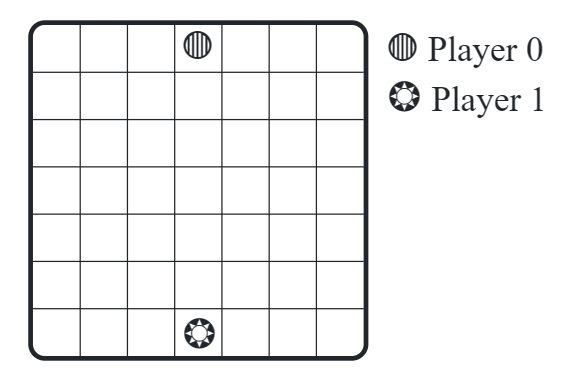
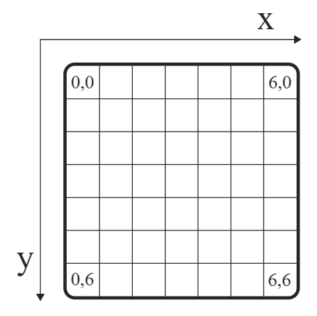

# Crazy Cam(e)l Competition
Note: This part of the exercise is a regular homework exercise. The competition is at the end of the task description. Make sure to read and complete the rest of the exercise first, though!

Two friends and experienced OCaml masters are trying to return home to their families, but they are currently at each other's houses. To make their journeys home a little more exciting they have decided to make a competition out of it: Whoever returns home first will be honored as the winner, while the loser has to use an imperative programming language for their next project.

To train for this contest, one of the participants decided to ask you—the best OCaml programmer they know—to help simulate the competition and develop a winning strategy!

To make the simulation easier, a few firm rules have been set to model the standoff:

The OCaml masters start on opposite sides of a $7\times 7$ board. The goal of each OCaml master is to reach any tile in the last row opposite the side of the board they started from. In each turn, the OCaml master can decide to either:

- take one step onto a neighbouring tile, by moving up, down, left, or right (but not diagonally, except in certain cases, see below), or
- send one of their loyal (O-)camels to block a part of the path. Each master starts with $8$ camels, one for each bit in a byte.



*The masters' starting positions.*

An OCaml master may only make a move, if:

- no camel blocks the OCaml master in the direction they want to move, and
- no other OCaml master is already standing on the tile they would like to move to

Since the OCaml masters' Code of Conduct prohibits fights between masters (it reminds them of data races caused by imperative programming), some special rules apply if two masters come face-to-face: a master who would like to make a move can jump over a master blocking their path:

- If an OCaml master would like to move towards some direction, but the neighbouring tile in that direction is occupied by another master (and only then), they may move one tile farther to behind that master. However, OCaml masters can still not jump over any camel in the way.
- If an OCaml master would like to move in some direction, but the neighbouring tile in that direction is occupied by another master and there is a camel or edge of the field directly behind that master, the OCaml master may instead make a move onto the tile of the opposing master and then, in the same turn, move one more tile in a direction perpendicular to the first move; ending in a tile diagonally adjacent to the tile they started on, now again positioned beside the other OCaml master.
Since camels are very stubborn, but also fair, there are some restrictions as to where they are willing to lay down:

- the camels are $2$ spaces long (but very skinny, i.e. $0$ spaces wide) and will only lay down on one of the edges that runs down the center of a $2\times 2$ square of tiles,
- the camels will not lie on top of each other,
- a camel will not block any player's last remaining path to the side of the board that player is trying to reach.

The tiles of the $7×7$ board are labeled by their $x$ and $y$ coordinates, where $x,y=0,0$ is the upper left corner, $x$ increases towards the right and $y$ increases towards the bottom of the board.



*The coordinate system used by the masters.*

Camels are also labelled by their $x$ and $y$ coordinates. Since OCamels always face the rising sun (which rises at the origin, $0,0$), the masters label their positions according to the upper-most, left-most tile the camel is adjacent to.

wall_pos.svg

In the diagram, camels are thick black bars. The four tiles adjacent to a camel are shown in grey. The camels are labelled by the upper-left tile of the square of tiles they touch.

You can find more diagrams to visualise these rules as part of the tasks below.

In many of the following functions, you receive or return a `game_state` record, which has the following definition:

```ocaml
type game_state = {
  camels : camel list;
  players : player list;
  next_player : int;
}
```

It maintains a list of all camels placed on the board, a list of players, and an index that represents the player whose turn comes next.

The type of `player`s is defined as follows:

```ocaml
type player = {
  position : position;
  current_camels : int;
}
```

which maintains their current position and a count of how many more camels they have left.

Camels and positions are represented as follows:

```ocaml
type position = int * int (* x, y *)
type camel = H of position
           | V of position
```

The constructor (`H`/`V`) determines if a camel is horizontal or vertical.

Finally, many functions receive a `configuration` parameter. It contains the size of the board and the number of camels each player starts with:

```ocaml
type configuration = {
  board_width : int;
  board_height : int;
  starting_camels : int;
}
```

For the tests and the competition, the size of the board will always be $7\times 7$ and each player will start with $8$ camels. However, if you write your functions to use the `configuration` parameter, you can try things out on smaller examples, too: perhaps for debugging.

## Tasks
In the first part of this exercise, you will implement some useful helper functions that we can test for bonus points! With that done, you can implement a (basic) strategy.

1. **camels_intersect**  
  Implement a function camels_intersect : camel -> camel -> bool. It should return true if the two camels overlap eachother. Camels overlap if they occupy the same space between two tiles or if they cross eachother.

*The first diagram shows three pairs of intersecting camels, where some camels have been drawn thinner to be able to distinguish them. None of the camels in the second diagram intersect.*

2. **is_valid_move**  
  Implement a function `is_valid_move : configuration -> game_state -> move -> bool`. The call `is_valid_move` cfg st mv returns whether mv is a valid move for st.next_player. A move is defined as follows:

```ocaml
type direction = Up
               | Down
               | Left
               | Right
               | UpLeft
               | UpRight
               | DownLeft
               | DownRight

type move = Move of direction
          | Camel of camel
```

A `Move` represents a player moving in that direction, whereas a `Camel` represents placing a camel at the given position. Which `Move` moves are valid are described above. Jump moves (as described above, and in the example below) that go straight are not represented any differently, e.g. `Move Left` could either be a regular move or a jump move. Jump moves that end diagonally (also see above and below) are represented by the last four constructors, e.g. moving up, then to the right to jump over an opposing master would be represented as `UpRight`, as would moving right then up. Remember, straight jump moves are only possible if the opposing OCaml master is directly adjacent to the player. Diagonal jump moves are furthermore only possible if: the opposing OCaml master is directly adjacent to the player, there is a camel behind that master, the move ends beside the opposing OCaml master, and no camel blocks the movement between the tile where the opposing master is positioned and the target tile. Additionally, check that the player does not move out of bounds (the board size is passed in the `configuration`).


*In each diagram, the moves indicated by arrows are only possible exactly when no camel blocks the arrow's path. In the first diagram, there are no camels around the master, so they may move `Up`, `Down`, `Left` or `Right`. In the second diagram, the master may also move Up, Down, Left or Right. However, if they move Up they travel a total distance of two tiles to behind the opposing master. In the last diagram, the master may move `UpLeft` or `UpRight`. This is because the upper camel is directly behind the opposing OCaml master. (The master may also move right or down as in the previous examples.)*

A `Camel` move is valid if:

- The player still has at least one camel.
- No part of the camel is out of bounds. In particular, camels must always be on the edge between a $2\times 2$ square of tiles, so they cannot be on the very edges of the board.
- No camel already on the board intersects the camel being placed.
- The placed camel does not block any player's last path to the side they are trying to reach. In particular, a player may not block themselves off.

An example of four invalid camel placements.

*Hint: you will need to implement a breadth- or depth- first search of the game board. With the rules we have defined, you only need to consider orthogonal moves (up, down, left or right) and you can ignore players that seem to block the path while doing the search, because jump moves prevent players from actually blocking the path.*

3. **list_valid_moves**  
    Implement a function `list_valid_moves : configuration -> game_state -> move list.` The call `list_valid_moves cfg gst` should return a list of all valid moves for `gst.next_player` from the game state provided in `gst`.

    *Hint: use your implementation of `is_valid_move`*

4. **has_won**  
    Implement a function `has_won : configuration -> game_state -> bool`, that returns whether the player that just moved has won in the given gamestate. Since the `game_state` contains the index of the next player, you should check if the other player has just won. A player has won if they have reached the opposite side of the board they started on: Player $0$ needs to reach the bottom of the board, while Player $1$ needs to reach the top.

    For example, has_won cfg gst where gst.next_player is $0$ checks if Player $1$ has reached the top of the board.

5. **apply_move**  
    Implement a function `apply_move : configuration -> game_state -> move -> game_state`. The call `apply_move cfg gst mv` returns (a copy of) `gst` that represents the state of the game after `gst.next_player` makes the given `move`, `mv`. You may assume the move is valid. Specifically, you need to:

     - If the move is Camel w, add to the gst.camels tile
     - If the move is Move d, update the position stored for the player at index gst.next_player in gst.players (don't change the order of the players)
     - Either way, update gst.next_player ($0$ becomes $1$ and vice-versa)
6. **make_move**  
    Finally, implement a function `make_move : random_supplier -> time_supplier -> configuration -> game_state -> move`. Given the current state of the game, it should return the best move your strategy can come up with! Your `make_move` method is tested against an OCaml master performing random valid moves, which it should be able to beat.  
    You can ignore the first two parameters if your strategy does not need randomness and you don't need to know how much time you have available. If your strategy needs those things, read the section about the competition below.

*Note: the tests check the function `make_move_state` which is given in the template and just calls `make_move` with the appropriate parameters. There is more about that function in the section about the competition. If you don't want to implement an advanced strategy, don't change `make_move_state`. If you do implement an advanced strategy, you **do not** need to also implement a separate strategy in `make_move`.*

### Tips and Notes
The function `make_move` knows which player to play as based on the value of `next_player` in the game state. The function `make_move_state` can know which player it is by looking at the length of the list of moves passed to it the first time it is called.

Don't change anything in `types/types.mli`, `src/assignment.mli` or the provided `dune` files, unless the changes are temporary (e.g. for testing) and everything works without the changes. The tests and the competition will ignore the changes to those files.

You can use `dune exec runner/runner.exe` to let your strategy play against itself and print the result to the console. This will only work properly once all of the above functions have been correctly implemented.

## Competition
*The competition is a bonus exercise! However, working on a winning strategy is a great opportunity to practice everything you've learned about OCaml so far. There are also prizes, including bonus points, for the best strategies in the competition.*

The two OCaml masters decided to hold a competition to find out who has the best strategy for the Crazy Camel Game. You are automatically entered into the competition by submitting a working strategy to Artemis. If you want your real name to be shown on the leaderboard, delete the file anonymous and commit and push the change (git rm anonymous then commit and push as usual).

You can see the results of all games on the contest web page at [crazycaml.pl.cit.tum.de](https://crazycaml.pl.cit.tum.de).

### Prizes and Rewards
As a token of the OCaml masters' thanks, the three winners of the competition will receive a badge displaying the OCaml masters' insignia (i.e. an OCaml sticker). If two players are tied, the player who won against the other, both as player $0$ and as player $1$, wins. If there is no such player, the shorter submission (measured by number of [lexer tokens](https://v2.ocaml.org/api/compilerlibref/Parser.html#TYPEtoken) in their source files) wins, since the OCaml masters prize concise and compact definitions!

Additionally, the top 10 players will receive woven camel hair strands of fine quality, which the OCaml masters use as currency (i.e. bonus points towards the grade bonus):

| Position | Bonus Points |
|:--------:|-------------:|
| 1 🥇     |     20       |
| 2 🥈     |     15       |
| 3–5 🥉   |     10       |
| 6–10 🐫  |      5       |

In the case of ties, the tied players will all receive the same number of points, but players further down on the scoreboard will not move up because of it. For example: if two players tie for first, they will both receive 20 points, but the next player will receive 10, and no player will receive 15.

### Technical Details
Since the provided game_state might be limiting, we have left the type state abstract. You may set state within the file assignment.ml to whatever type you find useful, for example a record type with additional tiles. (Don't change game_state or any other signatures that explicitly mention game_state though). Once you change state, you also need to change get_initial_state : random_supplier -> time_supplier -> configuration -> state. Use the implementation in the template to get an idea for what to do. Additionally, you need to change make_move_state : random_supplier -> time_supplier -> configuration -> move list -> state -> move * state. This is the function that actually plays the game. You can also look at the template for an idea of what to do here.

The functions get_initial_state and make_move_state are used as follows:

Once a game starts, the function get_initial_state is called once. This creates the initial state for your strategy, passed to the first call to make_move_state.

Every time it's your turn, make_move_state is called with your current state. You should return a tuple of the move your strategy wants to make and an updated state. The updated state will be passed to the next call of make_move_state. The move list parameter contains a list of all moves made since the last time your strategy played, or since the beginning of the game if it hasn't had a turn yet this game. That means on the first call to make_move_state, the move list will be:

empty, if you are Player 
0
0
a singleton list [m] where m is the other player's first move, if you are Player 
1
1.
After the first move, the move list will always be a singleton list with the opposing player's most recent move.

That means, at a minimum, your state should store the same information as in game_state, although the format and any additions are up to you. Also, it means that in make_move_state you are responsible for updating your state to reflect the moves that the other player and that you make, just like in the template.

The `random_supplier` and `time_supplier` functions allow your strategy to use randomness and to know how much time it has left. Each call of `random_supplier ()` returns a random `float` in the (inclusive) interval $[0.0,1.0]$. Each call of `time_supplier ()` returns a non-negative `float` that indicates how much time is left to make your move, in seconds. Exactly how much time you have is defined below.

### Additional Rules for the Competition
The competition runs under [time control](https://en.wikipedia.org/wiki/Time_control), i.e. you have a limited amount of time to initialize your strategy and make a move. We use the increment method: You start with $10$ seconds on the clock. Whenever it becomes your turn, $1$ second is added to your clock. During a call to your `initialize_strategy` or `make_move_state` functions, the clock counts down. (This means that any time you don't use during one move is available during the next). If your clock runs out before the call to one of those functions returns, you lose on time.